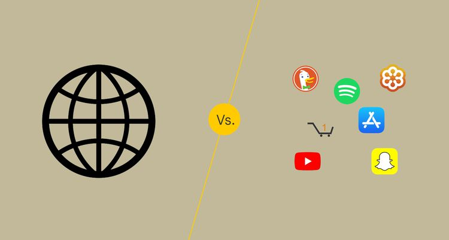
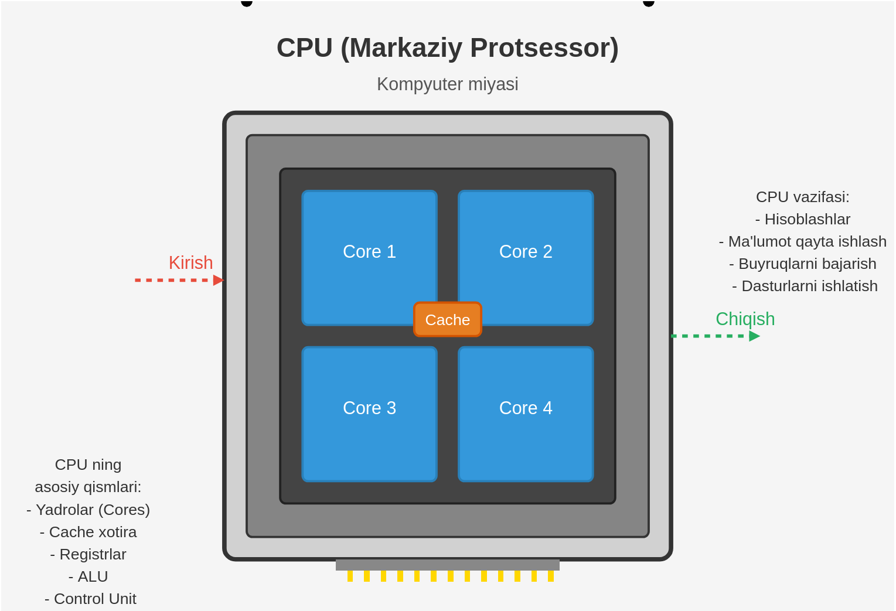

# Tarmoq va Web asoslari

***

#### Web

Web (Butunjahon o'rgimchak to'ri) - internet orqali ulangan va HTTP protokoli yordamida bog'langan hujjatlar tizimi. Web sahifalar, rasmlar, video va boshqa multimedia ma'lumotlarni o'z ichiga oladi.

<figure><figcaption></figcaption></figure>

#### Internet

Internet - butun dunyo bo'ylab kompyuterlarni bir-biriga bog'laydigan global tarmoq. U turli protokollar yordamida ma'lumot almashinuvini ta'minlaydi va web, elektron pochta, fayl almashinuvi kabi xizmatlarni qo'llab-quvvatlaydi.

#### Protocol

Protokol - kompyuterlar o'rtasida ma'lumot almashinishning qoidalar to'plami. Masalan, HTTP (veb-sahifalar uchun), FTP (fayllar uchun), SMTP (elektron pochta uchun).

#### Port

Port - tarmoq orqali ulanish uchun raqamli identifikator. Har bir xizmat (web serveri, elektron pochta va boshqalar) o'z portiga ega. Masalan, HTTP uchun 80-port, HTTPS uchun 443-port.

#### Domain

Domen - internetdagi adres tizimi, masalan google.com, facebook.com. IP manzillarni eslab qolish qiyin bo'lgani uchun domenlar qo'llaniladi. DNS (Domain Name System) domenlarni IP manzillarga tarjima qiladi.

#### Host

Host - internetga ulangan va xizmatlar taqdim etadigan qurilma. Veb-server, ma'lumotlar bazasi serveri yoki boshqa turdagi server bo'lishi mumkin. "Hosting" deganda esa veb-saytlarni joylashtiradigan xizmat tushuniladi.

#### IP

IP (Internet Protocol) - internet orqali ma'lumotlarni yo'naltiradigan manzil tizimi. IPv4 (masalan, 192.168.1.1) va IPv6 formatlarida bo'ladi. Har bir internet qurilmasi unikal IP manzilga ega.

#### OSI

OSI (Open Systems Interconnection) - tarmoq aloqalarini tushuntiruvchi 7 qatlamli model. Bu qatlamlar: Fizik, Ma'lumotlar bog'lamasi, Tarmoq, Transport, Sessiya, Taqdimot va Amaliy qatlamlardan iborat.

<figure><figcaption></figcaption></figure>

#### CPU

CPU (Markaziy protsessor) - kompyuterdagi hisoblash operatsiyalarini bajaradigan asosiy chip. "Kompyuterning miyasi" deb ham ataladi.

<figure><figcaption></figcaption></figure>

#### RAM

RAM (Tezkor xotira) - kompyuter ishlatilayotgan vaqtda ma'lumotlarni vaqtincha saqlash uchun ishlatiladigan xotira. Elektr ta'minoti o'chganda ma'lumotlar yo'qoladi.

<figure><figcaption></figcaption></figure>

#### Hard Storage

Qattiq disk - ma'lumotlarni doimiy saqlash qurilmasi. HDD (Hard Disk Drive) yoki SSD (Solid State Drive) shaklida bo'lishi mumkin. RAM dan farqli o'laroq, elektr ta'minoti o'chganda ham ma'lumotlar saqlanib qoladi.

<figure><figcaption></figcaption></figure>

#### Network card

Tarmoq kartasi - kompyuterni internetga yoki lokal tarmoqqa ulash uchun kerak bo'ladigan qurilma. U kabellar orqali yoki simsiz ulanishlarni ta'minlaydi.

<figure><figcaption></figcaption></figure>

#### Encrypt / Decrypt

Shifrlash / Deshifrlash - ma'lumotlarni himoyalash va himoyadan chiqarish jarayoni. Shifrlangan ma'lumotni faqat tegishli kalitga ega bo'lgan shaxs o'qiy oladi.

#### Encoding formats (UTF-8, ASCII)

Kodlash formatlari - matnli ma'lumotlarni kompyuter tushuna oladigan raqamli formatga o'tkazish usullari. UTF-8 ko'plab tillar belgilarini qo'llab-quvvatlaydi, ASCII esa ingliz harflari uchun mo'ljallangan eski format.

#### Network speed

Tarmoq tezligi - internetdagi ma'lumot uzatish tezligi, odatda Mbps (megabit sekundiga) bilan o'lchanadi. Yuqori tezlik video, audio va katta fayllarni tezroq yuklab olish imkonini beradi.

#### Network

Tarmoq - bir-biri bilan ulangan kompyuterlar tizimi. Lokal tarmoq (LAN) kichik hududda (uy yoki ofis), global tarmoq (WAN) esa katta hududlarda ishlaydi.

<figure><figcaption></figcaption></figure>

#### Web Server (nginx, apache)

Veb-server - veb-saytlarni saqlash va foydalanuvchilarga taqdim etish uchun mo'ljallangan dasturiy ta'minot. Nginx va Apache eng mashhur veb-serverlar hisoblanadi.

#### Web Client

Veb-mijoz - veb-sahifalarni ko'rish uchun ishlatiladigan dastur, odatda brauzer (Chrome, Firefox, Safari va boshqalar).

#### Firewall

Brandmauer - tizimni ruxsatsiz kirishdan himoya qiluvchi dasturiy yoki apparat vositasi. U tarmoq trafikini kuzatib boradi va xavfli urinishlarni bloklaydi.

#### Web Application Server

Veb-ilova serveri - veb-ilovalarni ishga tushirish va boshqarish uchun mo'ljallangan server turi. U veb-server va ma'lumotlar bazasini bog'laydi, dinamik kontentni yaratadi va foydalanuvchi so'rovlarini qayta ishlaydi.
